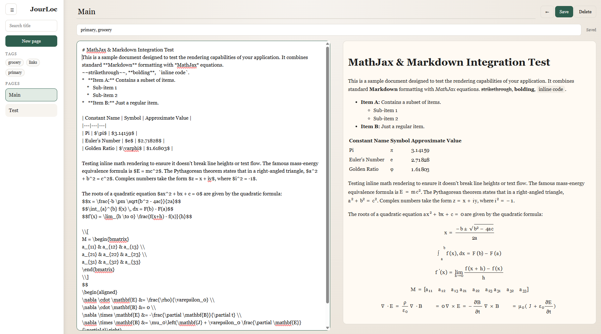

# JourLoc

JourLoc is a self-hosted journaling web app for keeping personal notes on a local network. It uses one shared password instead of separate user accounts, so any device on your LAN can open the app and access the same journal.



## What it does
- Create, edit, and delete journal pages.
- Write page content in Markdown.
- Add tags to pages and filter by tag.
- Search pages by title.
- Preview Markdown and math equations in the browser.
- Use a collapsible sidebar to navigate pages quickly.

## How it works
- The backend is a single Rust service built with Axum.
- Data is stored in Postgres.
- The app is intended to run in Docker and configured with environment variables.
- Static files are served by the Rust backend, and browser vendor files are copied into the image at build time.
- The app works offline after the image is built.

## Environment variables
Create a `.env` file from `.env.example` and set:
- `APP_PASSWORD`: the shared login password
- `SESSION_SECRET`: secret used to sign the login session cookie
- `DATABASE_URL`: Postgres connection string
- `PORT`: port the app listens on

## Quick start with Docker
1. Copy `.env.example` to `.env` and update the values.
2. Start the stack:

```bash
docker compose up --build
```

3. Open the app at `http://localhost:3000`.

The Docker build uses Node only to fetch browser-side assets such as the Markdown and math rendering libraries. The running container does not need Node.

## Development
1. Make sure Postgres is running and `DATABASE_URL` points to it.
2. Build and run the Rust backend with Cargo inside a Rust environment or container.
3. Open the app on the configured port.

## Notes
- The database is meant to be persisted with a Docker volume so data survives image rebuilds and redeploys.
- The app currently uses a single shared password instead of individual user accounts.
- Markdown and math rendering are handled locally, so the app does not need external APIs after the image is built.
